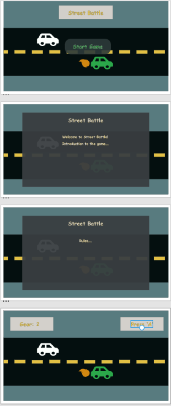

# game-proposal

## **Title**: Street Battle

### **Description:** 
>Street racing game. User or users will race their cars shifting and boosting to the finish line. A little focus and quick reflexes a winner will rise to the top!

### **Rules of the game:** 
> When the race starts the user will have to shift at the appropiate time using the "up" and "down" arrow keys. When prompted to do so, the user will have a chance to use a Nitrous boost using the "spacebar" key. Their car must reach the finish line first to win the game. 

### **Technical Challenges:** 
* Creating a speed for different gear shifts
* Getting the cars to shift upon command. 
* When shifting up the car should speed up and when shifting down the car will loose speed. 
* Activating boost at 3rd gear.
* Multiplayer Mode

### **Wireframe**

### **Additional Features:** 
* Place props on the side of the road for visual effects

### **Timeline:** 
_Wednesday:_ 
* Proposal Gets Approved 
* Complete Wireframe
* Learn/Understand JQuery

_Thursday:_ 
* Plan out code
* Pseudo Code
* Start Coding; JS

_Friday:_
* JS

_Saturday:_ 
* JS

_Sunday:_
* JS & CSS

_Monday:_
* JS & CSS
* Final Testing & Review